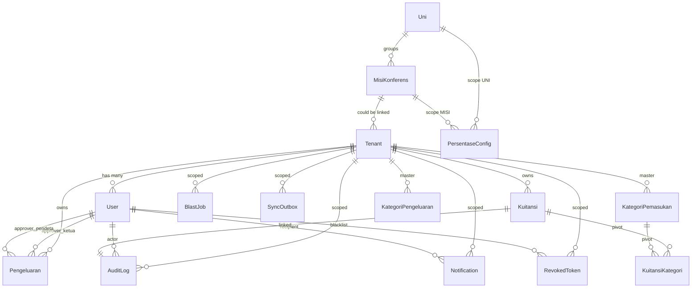

# FLIPUS — Architecture Map
**Project**: FLIPUS (Financial Ledger & Integrated Perpuluhan Umbrella System)
**Owner**: GMAHK UKIKT (Gereja Masehi Advent Hari Ketujuh — Uni Konferens Indonesia Kawasan Timur)
**Version audited**: v2.0.0 (2026-09-02), baseline 9519eb7
**Branch**: `audit/comprehensive-review`
**Generated by**: FASE 1 Audit (Roo)

> Dokumen ini memetakan arsitektur sistem FLIPUS **apa adanya** (deskriptif, tanpa judgement). Analisa, rekomendasi, dan rekomendasi perubahan disimpan di [`AUDIT_REPORT.md`](AUDIT_REPORT.md:1) (FASE 3) dan file lain.

---

## Daftar Isi
1. [Tumpukan Teknologi (Tech Stack)](#1-tumpukan-teknologi-tech-stack)
2. [Struktur Folder](#2-struktur-folder)
3. [Model Data (ERD)](#3-model-data-erd)
4. [Alur Data — Kas Masuk & Kas Keluar → Laporan](#4-alur-data--kas-masuk--kas-keluar--laporan)
5. [API Endpoints — Matriks Lengkap](#5-api-endpoints--matriks-lengkap)
6. [Role × Permission Matrix](#6-role--permission-matrix)
7. [Hierarki Organisasi & Multi-Tenant](#7-hierarki-organisasi--multi-tenant)
8. [Layanan Pendukung (Services)](#8-layanan-pendukung-services)
9. [Frontend Pages & Components](#9-frontend-pages--components)
10. [Catatan Audit (untuk FASE berikutnya)](#10-catatan-audit-untuk-fase-berikutnya)

---

## 1. Tumpukan Teknologi (Tech Stack)

### Backend (FastAPI)
| Layer | Tech | Sumber |
|---|---|---|
| Web Framework | **FastAPI** | [`app/main.py`](app/main.py:1) |
| ORM | **SQLAlchemy 2.0** (declarative) | [`app/core/database.py`](app/core/database.py:13) |
| Validation | **Pydantic v2** + `pydantic-settings` | [`app/core/config.py`](app/core/config.py:3) |
| Auth | **python-jose** (JWT HS256) | [`app/core/security.py`](app/core/security.py:1) |
| Password | **bcrypt** | [`app/core/security.py`](app/core/security.py:1) |
| PII Encryption | **Fernet** (cryptography) | [`app/core/security.py`](app/core/security.py:1) — `encrypt_pii()/decrypt_pii()` |
| Scheduler | **APScheduler** (background) | [`app/services/reset_scheduler.py`](app/services/reset_scheduler.py:1) |
| PDF | **ReportLab** | [`app/services/pdf_generator.py`](app/services/pdf_generator.py:1) |
| OCR | **Google Gemini Vision** (`gemini-1.5-flash`) + **Ollama** fallback | [`app/core/config.py`](app/core/config.py:15) |
| WhatsApp | **Fonnte API** | [`app/services/whatsapp.py`](app/services/whatsapp.py:1) |
| 2FA TOTP | `pyotp` + `qrcode` (inferred from usage) | [`app/services/twofa_service.py`](app/services/twofa_service.py:1) |

### Database
- **Default**: SQLite (`./flipus_local.db`) — offline-first untuk jemaat lokal
- **Optional**: PostgreSQL (`DATABASE_URL_CLOUD`)
- Auto-create tables on startup via `Base.metadata.create_all(bind=engine)` di [`app/main.py`](app/main.py:1)
- **Tidak ada migration tool** (Alembic) — schema version dikelola via `scripts/seed_*.py` + comments

### Frontend (Vite + React 18)
| Layer | Tech |
|---|---|
| Bundler | Vite |
| Framework | React 18 |
| Language | TypeScript |
| Styling | Tailwind CSS ("Sabbath Ledger" theme) |
| HTTP | Custom `lib/api.ts` |
| Auth | `lib/auth.tsx` (React Context) |

### Infrastruktur (Production-ready)
- **Docker Compose** (`docker-compose.yml`): 3 services — backend, frontend, nginx
- **Nginx** (`nginx.conf`): reverse proxy + SSL termination
- **Dockerfiles**: `backend.Dockerfile`, `frontend.Dockerfile`

### Environment Variables (dari `.env.example`)
```
SECRET_KEY                  # JWT signing
SECRET_KEY_PREVIOUS         # dual-key rotation grace window
PII_ENCRYPTION_KEY          # Fernet key
LICENSE_TENANT_SIGNATURE_SALT  # anti-clone
DATABASE_URL_LOCAL          # sqlite default
DATABASE_URL_CLOUD          # postgres optional
FONNTE_TOKEN                # WA gateway
GEMINI_API_KEY              # OCR
OLLAMA_BASE_URL             # OCR fallback
ENFORCE_2FA_FOR_SENSITIVE_ROLES  # default True
LOGIN_MAX_ATTEMPTS=5
LOGIN_LOCKOUT_MINUTES=15
ALLOWED_ORIGINS             # CORS
ADMIN_BOOTSTRAP_TOKEN       # untuk endpoint /seed, /register-tenant, /restore-db
```

---

## 2. Struktur Folder

```
Flipus/
├── app/                          # FastAPI backend
│   ├── main.py                   # entry point, mount semua router
│   ├── api/v1/                   # 23 router files (lihat §5)
│   ├── core/
│   │   ├── database.py           # engine + SessionLocal
│   │   ├── config.py             # Settings (pydantic-settings)
│   │   ├── security.py           # JWT, bcrypt, Fernet, signature
│   │   └── cache.py              # in-memory cache helper
│   ├── models/                   # SQLAlchemy models (lihat §3)
│   │   ├── tenant.py             # Tenant (multi-tenant)
│   │   ├── user.py               # User (5 roles)
│   │   ├── transaction.py        # Kuitansi (pemasukan)
│   │   ├── pengeluaran.py        # Pengeluaran (kas keluar, dual-stage approval)
│   │   ├── master.py             # Uni, MisiKonferens, PersentaseConfig
│   │   ├── kategori_pemasukan.py # v2.0 M3 — kategori fleksibel + pivot
│   │   ├── kategori_pengeluaran.py # v2.0 M5 — kategori fleksibel
│   │   ├── audit.py              # AuditLog (anti-tamper)
│   │   ├── notification.py       # in-app notifications
│   │   ├── revoked_token.py      # JWT blacklist (v1.5)
│   │   ├── blast_job.py          # WA blast idempotency
│   │   ├── sync.py               # SyncOutbox (anonymized pull)
│   │   └── wa_session.py         # WA state machine per sender
│   ├── services/
│   │   ├── pdf_generator.py      # Kuitansi PDF
│   │   ├── pdf_gabungan.py       # Laporan Gabungan PDF (v2.0 M7)
│   │   ├── financial_calculator.py  # LEGACY (Layer 1→2 porsi calc)
│   │   ├── branding_service.py   # white-label (logo, color)
│   │   ├── tenant_service.py     # slugify, create
│   │   ├── user_creator.py       # bulk invite
│   │   ├── anonymizer.py         # PII anonymization untuk sync
│   │   ├── notification_service.py # fanout notif
│   │   ├── whatsapp.py           # Fonnte wrapper + retry
│   │   ├── whatsapp_service.py   # low-level wrapper
│   │   ├── wa_input_parser.py    # parsing teks WA
│   │   ├── wa_input_state.py     # staging state
│   │   ├── twofa_service.py      # TOTP setup/verify
│   │   ├── backup_service.py     # DB backup
│   │   ├── reset_scheduler.py    # APScheduler jobs
│   │   ├── retention_daemon.py   # cleanup daemon
│   │   └── urutan_counter.py     # auto-numbering kuitansi/pengeluaran
│   ├── utils/
│   │   ├── porsi_calculator.py   # NEW — Jerry's Model B
│   │   ├── financial_calculator.py  # (mirror? atau duplicate?)
│   │   ├── number_to_words.py    # "seratus ribu rupiah"
│   │   ├── nomor_kuitansi.py     # format nomor
│   │   ├── sabat_counter.py      # hitung sabat ke-N dalam tahun
│   │   ├── password_gen.py       # generate + validate
│   │   └── kategori_alias.py     # smart alias kategori
│   └── __init__.py
├── frontend/                     # Vite + React 18 + TS
│   ├── src/
│   │   ├── pages/                # 21 TSX pages (lihat §9)
│   │   ├── components/           # 9 shared components
│   │   ├── lib/                  # api.ts, auth.tsx, useDemoMode.ts
│   │   └── styles/               # Tailwind theme
│   ├── public/                   # static assets
│   ├── package.json
│   └── vite.config.ts
├── scripts/                      # 18 seed/utility scripts (lihat bawah)
├── tests/                        # pytest suite (jika ada)
├── docs/                         # dokumentasi tambahan
├── storage/                      # foto amplop, PDF, backup DB
├── docker-compose.yml
├── backend.Dockerfile
├── frontend.Dockerfile
├── nginx.conf
├── requirements.txt
├── .env / .env.example
├── README.md
├── CHANGELOG.md
└── DEMO_README.md
```

---

## 3. Model Data (ERD)

### 3.1 Daftar Model (21 tabel via [`app/models/__init__.py`](app/models/__init__.py:1))

| # | Model | File | Tabel | Peran |
|---|---|---|---|---|
| 1 | `Tenant` | [`tenant.py`](app/models/tenant.py:1) | `tenants` | Multi-tenant root |
| 2 | `User` | [`user.py`](app/models/user.py:1) | `users` | Akun + RBAC + 2FA |
| 3 | `Kuitansi` | [`transaction.py`](app/models/transaction.py:1) | `kuitansi` | **Pemasukan** (kuitansi persembahan) |
| 4 | `Pengeluaran` | [`pengeluaran.py`](app/models/pengeluaran.py:1) | `pengeluaran` | **Kas keluar** |
| 5 | `AuditLog` | [`audit.py`](app/models/audit.py:1) | `audit_logs` | Anti-tamper audit |
| 6 | `Notification` | [`notification.py`](app/models/notification.py:1) | `notifications` | In-app bell |
| 7 | `RevokedToken` | [`revoked_token.py`](app/models/revoked_token.py:1) | `revoked_tokens` | JWT blacklist |
| 8 | `BlastJob` | [`blast_job.py`](app/models/blast_job.py:1) | `blast_jobs` | WA blast idempotency |
| 9 | `KategoriPemasukan` | [`kategori_pemasukan.py`](app/models/kategori_pemasukan.py:18) | `kategori_pemasukan` | Master kategori (v2.0) |
| 10 | `KuitansiKategori` | [`kategori_pemasukan.py`](app/models/kategori_pemasukan.py:56) | `kuitansi_kategori` | Pivot many-to-many + nominal |
| 11 | `KategoriPengeluaran` | [`kategori_pengeluaran.py`](app/models/kategori_pengeluaran.py:17) | `kategori_pengeluaran` | Master kategori (v2.0) |
| 12 | `Uni` | [`master.py`](app/models/master.py:1) | `uni` | 3 master Uni GMAHK |
| 13 | `MisiKonferens` | [`master.py`](app/models/master.py:1) | `misi_konferens` | 12 master misi/konferens |
| 14 | `PersentaseConfig` | [`master.py`](app/models/master.py:1) | `persentase_config` | % porsi Jemaat/Misi/Uni |
| 15 | `SyncOutbox` | [`sync.py`](app/models/sync.py:1) | `sync_outbox` | Anonymized payload (v1.1) |
| 16 | `WaSession` | [`wa_session.py`](app/models/wa_session.py:20) | `wa_sessions` | State machine per sender (T94) |

> **Catatan**: Ada beberapa model lain yang di-import via SQLAlchemy di dalam service (`MisiKonferens`, `Uni`, `PersentaseConfig`) dan beberapa helper yang mungkin AutoDefine di module lain.

### 3.2 Diagram Relasi (tekstual/Mermaid)



### 3.3 Skema Kunci

#### `Tenant` ([`tenant.py`](app/models/tenant.py:1))
- **Identity legacy 3-tier**: `nama_uni`, `nama_kantor_misi`, `nama_jemaat_lokal`
- **SaaS (v1.3)**: `tenant_signature` (license guard), `slug`, `subdomain`, `plan`, `status` (`active`/`suspended`/`archived`), `owner_user_id`
- **White-label**: `logo_url`, `primary_color`, `secondary_color`, `footer_text`

#### `User` ([`user.py`](app/models/user.py:1))
- `tenant_id` (FK), `username`, `password_hash` (bcrypt)
- `nomor_whatsapp` (plain untuk lookup) + `nomor_whatsapp_encrypted` (Fernet)
- `role` (5 role), `is_2fa_enabled`, `totp_secret_encrypted`, `backup_codes_hashed`, `password_changed_at`

#### `Kuitansi` ([`transaction.py`](app/models/transaction.py:1)) — **Pemasukan**
- `tenant_id`, `id_rekap_mingguan`, `nomor_kuitansi`
- `tanggal_sabat`, `nama_umat_encrypted`, `nomor_whatsapp_encrypted`, `foto_amplop_path`
- **Porsi fields** (legacy): `perpuluhan_x_angka`, `pt_angka`, `khusus_angka`, `total_pemberian_angka`
- **Computed**: `total_pemberian_huruf` (number_to_words)
- **Porsi hasil**: `porsi_kantor_misi`, `porsi_kas_jemaat`, `porsi_khusus_misi`, `porsi_khusus_jemaat`
- Status: `'draft'` / `'finalized'` / `'rejected'`
- `created_via`: `'web'` | `'ocr'` | `'wa'`
- `is_purged` (untuk right-to-be-forgotten, anonymized tapi nominal tetap)
- 4 composite indexes (query patterns)

#### `Pengeluaran` ([`pengeluaran.py`](app/models/pengeluaran.py:1)) — **Kas Keluar**
- `tenant_id`, `id_rekap_mingguan`, `nomor_pengeluaran` (format `OUT-YYYYMMDD-NNN`)
- `tanggal`, `tanggal_sabat`, `kategori_pengeluaran_id` (FK ke `KategoriPengeluaran`)
- `jumlah`, `deskripsi`, `penerima`, `metode_bayar`, `bukti_path`
- **Status workflow dual-stage**: `draft` → `pending_approval` → `approved_ketua` → `approved` (atau `rejected`)
- `approved_ketua_by_user_id`, `approved_pendeta_by_user_id`
- Catatan Jerry: `is_rutin=True` (Listrik, Air, Telpon, Gaji Kostor) → auto-approved Bendahara; `is_rutin=False` → butuh approval Ketua + Pendeta

#### `AuditLog` ([`audit.py`](app/models/audit.py:1))
- `tenant_id`, `id_rekap_mingguan`, `nomor_kuitansi_token`
- `porsi_dana_misi`, `verifikasi_sintaks_ai`
- `action` (LOGIN_FAILED, CROSS_TENANT_BLOCKED_*, SECURITY_WA_ALERT_*, dll)
- `payload_hash` (SHA-256, anti-tamper)

#### `PersentaseConfig` ([`master.py`](app/models/master.py:1))
- `scope` (MISI/UNI), `ref_id`
- `pct_x_jemaat` (default **1.0** ⚠️ — historis T101 bug, fixed v1.5.1 → `0.0`)
- `pct_pt_jemaat` (0.5), `pct_khusus_jemaat` (0.5)
- `pct_x_uni` (0.0), `pct_pt_uni` (0.0), `pct_khusus_uni` (0.0)

---

## 4. Alur Data — Kas Masuk & Kas Keluar → Laporan

### 4.1 Alur KAS MASUK (Pemasukan / Kuitansi)

```
┌─────────────────────────────────────────────────────────────────────┐
│   SUMBER INPUT                                                      │
├─────────────────────────────────────────────────────────────────────┤
│  • WEB Form (QuickInput / Dashboard) ─ created_via='web'            │
│  • OCR (foto amplop via Gemini Vision) ── created_via='ocr'         │
│  • WHATSAPP (1 nomor Fonnte, multi-jemaat state machine) ─ 'wa'     │
└────────────────┬────────────────────────────────────────────────────┘
                 │
                 ▼
         ┌──────────────────┐
         │  STAGING (ops)   │  ← WaSession state (T94) — TTL 30 menit
         └──────┬───────────┘
                │
                ▼
   ┌────────────────────────────┐
   │ POST /kuitansi (finalize)  │  ← Bendahara
   │   • Hitung porsi via       │
   │     porsi_calculator.py    │  (Jerry Model B)
   │   • Set status='draft'     │
   └────────┬───────────────────┘
            │
            ▼
   ┌────────────────────────────┐
   │ Approval Ketua Keuangan    │
   │ POST /kuitansi/{id}/approve│
   │   • status → 'finalized'   │
   │   • AuditLog created       │
   └────────┬───────────────────┘
            │
            ▼
   ┌────────────────────────────┐
   │ PDF Generation             │  ← pdf_generator.py
   │ GET /kuitansi/{id}/pdf     │  (ReportLab, branded)
   └────────┬───────────────────┘
            │
            ▼
   ┌────────────────────────────┐
   │ WA Blast (opsional)        │  ← BlastJob (idempotency_key UUID)
   │ POST /reports/blast-weekly │  via Fonnte, throttle 1.1 req/s
   └────────┬───────────────────┘
            │
            ▼
   ┌────────────────────────────┐
   │ AGREGASI                   │
   │  • /agregat/tenant (per jemaat)                                    │
   │  • /agregat/misi (per misi/konferens)                              │
   │  • /agregat/uni (UKIKT)                                            │
   │  • /agregat/sabat-ini, /ytd, /chart/mingguan                      │
   └────────┬───────────────────┘
            │
            ▼
   ┌────────────────────────────┐
   │ LAPORAN GABUNGAN (M7 v2.0) │  ← pdf_gabungan.py
   │ GET /laporan/gabungan/     │  (kuitansi + pengeluaran + bukti)
   │     {id_rekap_mingguan}    │
   │ GET /.../pdf               │
   │ POST /.../send-to-auditor  │
   └────────────────────────────┘
```

### 4.2 Alur KAS KELUAR (Pengeluaran)

```
┌─────────────────────────────────────────────────────────────────────┐
│   SUMBER INPUT                                                      │
├─────────────────────────────────────────────────────────────────────┤
│  • WEB (PengeluaranInput) ─ Bendahara                               │
│  • OCR (kuitansi/nota pengeluaran) ── pengeluaran_ocr.py            │
│  • WHATSAPP ── pengeluaran_wa.py                                    │
└────────────────┬────────────────────────────────────────────────────┘
                 │
                 ▼
   ┌────────────────────────────────────┐
   │ POST /pengeluaran/create           │
   │   • kategori_pengeluaran_id        │
   │   • is_rutin? (auto-approved by    │
   │     Bendahara) atau butuh approval │
   └────────┬───────────────────────────┘
            │
            ▼ (jika non-rutin)
   ┌────────────────────────────────────┐
   │ POST /pengeluaran/{id}/submit      │
   │   • status: draft → pending_approval
   └────────┬───────────────────────────┘
            │
            ▼
   ┌────────────────────────────────────┐
   │ DUAL-STAGE APPROVAL                │
   │   POST .../approve-ketua           │  ← Ketua Keuangan
   │   POST .../approve-pendeta         │  ← Pendeta
   │   POST .../reject                  │
   │   • status: pending → approved_    │
   │     ketua → approved               │
   └────────┬───────────────────────────┘
            │
            ▼
   ┌────────────────────────────────────┐
   │ AGREGASI PENGELUARAN               │
   │ GET /pengeluaran/rekap             │
   │ GET /pengeluaran/pending-count     │
   └────────┬───────────────────────────┘
            │
            ▼
   ┌────────────────────────────────────┐
   │ LAPORAN GABUNGAN (M7 v2.0)         │  ← digabung dengan Kuitansi
   └────────────────────────────────────┘
```

### 4.3 Alur Multi-Tenant Sync (legacy, v1.1)

```
JEMAAT (tenant)
    │
    ▼  Anonymizer (nama_umat_encrypted → masked)
SyncOutbox.payload_json
    │
    ▼  (POST /sync/upload)
MISI / UNI
    │
    ▼  (GET /sync/pull)
Lihat laporan agregat tanpa PII
```

---

## 5. API Endpoints — Matriks Lengkap

> **Path prefix**: `/api/v1` (semua router di-mount di [`app/main.py`](app/main.py:1))
> **Auth**: JWT Bearer + `get_current_user` dependency

### 5.1 `auth.py` — Autentikasi
| Method | Path | Tag | Auth | Role |
|---|---|---|---|---|
| POST | `/auth/login` | auth | public | username+password+(totp_code) |
| POST | `/auth/forgot-password` | auth | public | identifier (username/wa) |
| POST | `/auth/logout` | auth | JWT | own user |
| POST | `/auth/change-password` | auth | JWT | own user |

### 5.2 `twofa.py` — 2FA (TOTP)
| Method | Path | Auth | Role |
|---|---|---|---|
| GET | `/2fa/status` | JWT | own user |
| POST | `/2fa/setup` | JWT | own user (return QR + secret) |
| POST | `/2fa/verify` | JWT | own user (enable 2FA) |
| POST | `/2fa/disable` | JWT | own user (need totp+password) |
| POST | `/2fa/backup-codes` | JWT | own user (regenerate) |
| POST | `/2fa/login` | partial_token | step-2 after login |

### 5.3 `kuitansi.py` — Pencarian & Export (read-mostly)
| Method | Path | Auth | Role |
|---|---|---|---|
| GET | `/kuitansi/search` | JWT | BENDAHARA/KETUA/PENDETA/AUDITOR_MISI/ADMIN_UNI |
| GET | `/kuitansi/filter-meta` | JWT | BENDAHARA/KETUA/PENDETA/AUDITOR_MISI/ADMIN_UNI |
| GET | `/kuitansi/export` | JWT | BENDAHARA/KETUA/PENDETA/AUDITOR_MISI/ADMIN_UNI |
| GET | `/kuitansi/{id}/pdf` | JWT | BENDAHARA/KETUA/PENDETA/AUDITOR_MISI/ADMIN_UNI |

### 5.4 `dashboard.py` — Approval Workflow
| Method | Path | Auth | Role |
|---|---|---|---|
| GET | `/sabat-info` | JWT | BENDAHARA/KETUA/PENDETA |
| POST | `/kuitansi` | JWT | BENDAHARA (create draft) |
| POST | `/kuitansi/{id}/approve` | JWT | KETUA_KEUANGAN/PENDETA |
| POST | `/kuitansi/{id}/reject` | JWT | KETUA_KEUANGAN/PENDETA |
| GET | `/kuitansi/pending` | JWT | KETUA_KEUANGAN/PENDETA |
| GET | `/kuitansi/rejected` | JWT | KETUA_KEUANGAN/PENDETA |

### 5.5 `quick_input.py` — PWA Quick Input
| Method | Path | Auth | Role |
|---|---|---|---|
| POST | `/kuitansi/quick-input` | JWT | BENDAHARA |
| GET | `/kategori/list` | JWT | BENDAHARA |

### 5.6 `pengeluaran.py` — Kas Keluar
| Method | Path | Auth | Role |
|---|---|---|---|
| GET | `/kategori-pengeluaran/list` | JWT | BENDAHARA/KETUA/PENDETA |
| POST | `/kategori-pengeluaran/create` | JWT | BENDAHARA |
| GET | `/pengeluaran/list` | JWT | BENDAHARA/KETUA/PENDETA |
| POST | `/pengeluaran/create` | JWT | BENDAHARA |
| PUT | `/pengeluaran/{id}/update` | JWT | BENDAHARA (only if draft) |
| POST | `/pengeluaran/{id}/submit` | JWT | BENDAHARA |
| POST | `/pengeluaran/{id}/approve-ketua` | JWT | KETUA_KEUANGAN |
| POST | `/pengeluaran/{id}/approve-pendeta` | JWT | PENDETA |
| POST | `/pengeluaran/{id}/reject` | JWT | KETUA_KEUANGAN/PENDETA |
| GET | `/pengeluaran/pending-count` | JWT | KETUA/PENDETA |
| GET | `/pengeluaran/rekap` | JWT | BENDAHARA/KETUA/PENDETA |

### 5.7 `agregat.py` — Agregasi Multi-Tier
| Method | Path | Auth | Role |
|---|---|---|---|
| GET | `/agregat/tenant` | JWT | BENDAHARA/KETUA/PENDETA (own tenant) |
| GET | `/agregat/misi` | JWT | AUDITOR_MISI/ADMIN_UNI (scope misi) |
| GET | `/agregat/uni` | JWT | ADMIN_UNI |
| GET | `/agregat/sabat-ini` | JWT | BENDAHARA/KETUA/PENDETA |
| GET | `/agregat/ytd` | JWT | semua |
| GET | `/agregat/chart/mingguan` | JWT | semua |

### 5.8 `laporan_gabungan.py` — Laporan Gabungan (v2.0 M7)
| Method | Path | Auth | Role |
|---|---|---|---|
| GET | `/laporan/gabungan/{id_rekap_mingguan}` | JWT | BENDAHARA/KETUA/PENDETA/AUDITOR_MISI |
| GET | `/laporan/gabungan/{id_rekap_mingguan}/pdf` | JWT | BENDAHARA/KETUA/PENDETA/AUDITOR_MISI |
| POST | `/laporan/gabungan/{id_rekap_mingguan}/send-to-auditor` | JWT | BENDAHARA/KETUA |

### 5.9 `reports.py` — Laporan Mingguan + Blast
| Method | Path | Auth | Role |
|---|---|---|---|
| GET | `/reports/sabat-info` | JWT | BENDAHARA |
| GET | `/reports/mingguan` | JWT | BENDAHARA/KETUA/PENDETA |
| GET | `/reports/summary` | JWT | BENDAHARA/KETUA/PENDETA |
| POST | `/reports/blast-weekly` | JWT | BENDAHARA |
| POST | `/reports/keuangan` | JWT | BENDAHARA |

### 5.10 `master.py` — Master Data
| Method | Path | Auth | Role |
|---|---|---|---|
| GET | `/master/uni` | JWT | semua |
| GET | `/master/misi` | JWT | semua |
| POST | `/master/seed` | JWT | ADMIN_BOOTSTRAP_TOKEN (Jerry only) |
| GET | `/master/persentase` | JWT | AUDITOR_MISI/ADMIN_UNI |
| POST | `/master/persentase` | JWT | ADMIN_UNI |

### 5.11 `tenants.py` — Tenant Management (SaaS)
| Method | Path | Auth | Role |
|---|---|---|---|
| GET | `/tenants/resolve/{identifier}` | public | subdomain resolution |
| GET | `/tenants/me` | JWT | own tenant info |
| GET | `/tenants` | JWT | ADMIN_UNI |
| GET | `/tenants/{id}` | JWT | ADMIN_UNI |
| PATCH | `/tenants/{id}` | JWT | ADMIN_UNI |
| PATCH | `/tenants/{id}/status` | JWT | ADMIN_UNI (suspend/activate) |
| PATCH | `/tenants/{id}/plan` | JWT | ADMIN_UNI |
| PATCH | `/tenants/{id}/branding` | JWT | ADMIN_UNI/TENANT_OWNER |
| GET | `/tenants/{id}/branding` | JWT | semua (own tenant) |
| POST | `/tenants/{id}/logo` | JWT | ADMIN_UNI/TENANT_OWNER |
| DELETE | `/tenants/{id}/logo` | JWT | ADMIN_UNI/TENANT_OWNER |
| GET | `/tenants/logo/{tenant_id}` | public | (logo serving) |

### 5.12 `users.py` — User Management
| Method | Path | Auth | Role |
|---|---|---|---|
| GET | `/users` | JWT | BENDAHARA/KETUA/PENDETA (own tenant) |
| DELETE | `/users/{user_id}` | JWT | BENDAHARA/ADMIN_UNI |

### 5.13 `onboarding.py` — Tenant Onboarding
| Method | Path | Auth | Role |
|---|---|---|---|
| POST | `/onboarding/register-tenant` | ADMIN_BOOTSTRAP_TOKEN | Jerry only |

### 5.14 `m8_managed.py` — Managed Users & Void (v2.0 M8)
| Method | Path | Auth | Role |
|---|---|---|---|
| POST | `/users/invite` | JWT | BENDAHARA/KETUA_KEUANGAN |
| POST | `/kuitansi/{id}/void` | JWT | KETUA_KEUANGAN/PENDETA (audit+reason) |
| POST | `/pengeluaran/{id}/void` | JWT | KETUA_KEUANGAN/PENDETA (audit+reason) |

### 5.15 `wa_input.py` — WhatsApp Inbound
| Method | Path | Auth | Role |
|---|---|---|---|
| GET | `/wa/inbound` | JWT | BENDAHARA (debug) |
| POST | `/wa/inbound` | X-Fonnte-Signature | Fonnte webhook |
| GET | `/kuitansi/staging` | JWT | BENDAHARA |
| DELETE | `/kuitansi/staging/{item_id}` | JWT | BENDAHARA |
| POST | `/kuitansi/finalize-staging` | JWT | BENDAHARA |

### 5.16 `pengeluaran_wa.py` — Pengeluaran via WA
| Method | Path | Auth | Role |
|---|---|---|---|
| POST | `/wa/pengeluaran/inbound` | X-Fonnte-Signature | Fonnte webhook |
| POST | `/wa/pengeluaran/reset` | JWT | BENDAHARA |

### 5.17 `pengeluaran_ocr.py` — OCR Pengeluaran
| Method | Path | Auth | Role |
|---|---|---|---|
| POST | `/pengeluaran/ocr-batch-upload` | JWT | BENDAHARA |
| POST | `/pengeluaran/ocr-save` | JWT | BENDAHARA |

### 5.18 `scanner.py` — OCR Kuitansi (legacy)
| Method | Path | Auth | Role |
|---|---|---|---|
| POST | `/batch-upload` | JWT | BENDAHARA |
| POST | `/save-batch` | JWT | BENDAHARA |

### 5.19 `sync.py` — Multi-Tenant Sync
| Method | Path | Auth | Role |
|---|---|---|---|
| POST | `/sync/upload` | JWT | BENDAHARA (push anonymized) |
| GET | `/sync/pull` | JWT | AUDITOR_MISI/ADMIN_UNI |

### 5.20 `notifications.py` — In-App Notifikasi
| Method | Path | Auth | Role |
|---|---|---|---|
| GET | `/notifications` | JWT | own user |
| GET | `/notifications/unread-count` | JWT | own user |
| POST | `/notifications/{id}/read` | JWT | own user |
| POST | `/notifications/read-all` | JWT | own user |
| DELETE | `/notifications/{id}` | JWT | own user |
| DELETE | `/notifications/clear-all` | JWT | own user |

### 5.21 `register.py` — Registrasi Role-specific
| Method | Path | Auth | Role |
|---|---|---|---|
| POST | `/register/pendeta` | JWT+2FA | ADMIN_UNI |
| POST | `/register/auditor` | JWT+2FA | ADMIN_UNI |
| POST | `/register/admin` | ADMIN_BOOTSTRAP_TOKEN | Jerry only |

### 5.22 `admin.py` — Jerry-only Admin Endpoints
| Method | Path | Auth | Role |
|---|---|---|---|
| GET | `/admin/fonnte/device-status` | ADMIN_BOOTSTRAP_TOKEN | Jerry |
| POST | `/admin/trigger-reset` | ADMIN_BOOTSTRAP_TOKEN | Jerry |
| POST | `/admin/backup-db` | ADMIN_BOOTSTRAP_TOKEN | Jerry |
| GET | `/admin/backups` | ADMIN_BOOTSTRAP_TOKEN | Jerry |
| POST | `/admin/restore-db` | ADMIN_BOOTSTRAP_TOKEN | Jerry |
| POST | `/admin/trigger-backup` | ADMIN_BOOTSTRAP_TOKEN | Jerry |
| POST | `/admin/recompute-porsi` | ADMIN_BOOTSTRAP_TOKEN | Jerry |
| GET | `/admin/audit-logs` | ADMIN_BOOTSTRAP_TOKEN | Jerry |

### 5.23 `demo.py` — Demo Helpers (dev only)
| Method | Path | Auth | Role |
|---|---|---|---|
| GET | `/demo/login-as/{role}` | dev-only | dev only |
| GET | `/demo/info` | dev-only | dev only |
| GET | `/demo/tenants` | dev-only | dev only |

**Total**: 23 router files, **~110 endpoint**.

---

## 6. Role × Permission Matrix

| Resource / Action | BENDAHARA | KETUA_KEUANGAN | PENDETA | AUDITOR_MISI | ADMIN_UNI |
|---|---|---|---|---|---|
| Create Kuitansi (draft) | ✅ | – | – | – | – |
| Approve Kuitansi | – | ✅ | ✅ | – | – |
| Reject Kuitansi | – | ✅ | ✅ | – | – |
| Void Kuitansi | – | ✅ | ✅ | – | – |
| View Kuitansi (own tenant) | ✅ | ✅ | ✅ | – | – |
| View Kuitansi (misi scope) | – | – | – | ✅ | ✅ |
| Create Pengeluaran | ✅ | – | – | – | – |
| Approve Pengeluaran (Ketua stage) | – | ✅ | – | – | – |
| Approve Pengeluaran (Pendeta stage) | – | – | ✅ | – | – |
| Reject Pengeluaran | – | ✅ | ✅ | – | – |
| Void Pengeluaran | – | ✅ | ✅ | – | – |
| Quick Input | ✅ | – | – | – | – |
| Upload OCR (kuitansi/pengeluaran) | ✅ | – | – | – | – |
| WA Inbound (Fonnte webhook) | (webhook) | – | – | – | – |
| View Agregat Tenant | ✅ | ✅ | ✅ | – | – |
| View Agregat Misi | – | – | – | ✅ | ✅ |
| View Agregat Uni | – | – | – | – | ✅ |
| View Laporan Gabungan (own) | ✅ | ✅ | ✅ | ✅ | – |
| Send Laporan to Auditor | ✅ | ✅ | – | – | – |
| Blast Mingguan | ✅ | – | – | – | – |
| Manage Kategori Pemasukan | ✅ | – | – | – | – |
| Manage Kategori Pengeluaran | ✅ | – | – | – | – |
| Invite User (M8) | ✅ | ✅ | – | – | ✅ |
| Delete User | ✅ (own tenant) | – | – | – | ✅ |
| Change Own Password | ✅ | ✅ | ✅ | ✅ | ✅ |
| Reset Password via WA | ✅ | ✅ | ✅ | ✅ | ✅ |
| Enable 2FA (mandatory) | opsional | opsional | opsional | **WAJIB** | **WAJIB** |
| Manage Tenant (status/plan/branding) | own (branding only) | – | – | – | ✅ |
| Manage Persentase Config | – | – | – | – | ✅ |
| Register Auditor/Pendeta | – | – | – | – | ✅ |
| Register Admin (Jerry only) | – | – | – | – | via bootstrap |
| Admin/Seed/Restore/Recompute (Jerry) | – | – | – | – | – |
| Receive Security WA Alert (T50) | – | – | – | – | ✅ |
| Cross-tenant access | **BLOCKED + WA alert** | **BLOCKED + WA alert** | **BLOCKED + WA alert** | scope only | scope only |

**5 role lengkap**: `BENDAHARA`, `KETUA_KEUANGAN`, `PENDETA`, `AUDITOR_MISI`, `ADMIN_UNI` ([`app/api/v1/auth.py:35`](app/api/v1/auth.py:35))

---

## 7. Hierarki Organisasi & Multi-Tenant

### 7.1 Hirarki 3-Tier

```
┌────────────────────────────────────────┐
│  UNI (3 master)                        │  ← Uni Konferens (UIKT, UIKB, UIKC)
│  • UKIKT = Uni Konferens Indonesia     │
│    Kawasan Timur                       │
└────────────┬───────────────────────────┘
             │ has many
             ▼
┌────────────────────────────────────────┐
│  MISI / KONFERENS (12 master)          │  ← Kantor Misi / Konferens
│  Contoh: UIKT-Mapano, UIKT-Sumba, dst │
└────────────┬───────────────────────────┘
             │ has many
             ▼
┌────────────────────────────────────────┐
│  JEMAAT LOKAL (multi-tenant SaaS)      │  ← Tenant = jemaat
│  Setiap jemaat = 1 Tenant (v1.3 SaaS) │
└────────────────────────────────────────┘
```

### 7.2 Multi-Tenant Pattern

- **Strategi**: Shared database + `tenant_id` column (Tahap 20)
- **License guard**: `Tenant.tenant_signature = SHA-256(uni | kantor_misi | jemaat | LICENSE_TENANT_SIGNATURE_SALT)` ([`app/core/security.py`](app/core/security.py:1))
- **Cross-tenant guard**: `require_role_in_tenant()` dependency + `_audit_cross_tenant_attempt()` + WA alert (T50) ([`app/api/v1/auth.py:89`](app/api/v1/auth.py:89))
- **Tenant status guard**: `active` / `suspended` / `archived` — login blocked untuk non-active
- **Tenant resolve**: subdomain (`*.flipus.app`) atau `tenant_slug` di form login
- **White-label branding**: per-tenant `logo_url`, `primary_color`, `secondary_color`, `footer_text`

### 7.3 Visibility Scope per Role

| Role | Scope |
|---|---|
| BENDAHARA | 1 jemaat (own tenant) |
| KETUA_KEUANGAN | 1 jemaat (own tenant) |
| PENDETA | 1 jemaat (own tenant) |
| AUDITOR_MISI | 1 misi/konferens (multi-jemaat di bawahnya) |
| ADMIN_UNI | 1 uni (multi-misi, multi-jemaat) |

---

## 8. Layanan Pendukung (Services)

| Service | Tanggung Jawab | File |
|---|---|---|
| `pdf_generator.py` | Kuitansi PDF (ReportLab, branded) | [`pdf_generator.py`](app/services/pdf_generator.py:1) |
| `pdf_gabungan.py` | Laporan Gabungan PDF (v2.0 M7) | [`pdf_gabungan.py`](app/services/pdf_gabungan.py:1) |
| `financial_calculator.py` | Legacy kalkulator porsi (Layer 1→2) | [`financial_calculator.py`](app/services/financial_calculator.py:1) |
| `porsi_calculator.py` (util) | **NEW — Jerry's Model B** | [`porsi_calculator.py`](app/utils/porsi_calculator.py:1) |
| `branding_service.py` | Apply white-label ke PDF/UI | [`branding_service.py`](app/services/branding_service.py:1) |
| `tenant_service.py` | slugify, create tenant | [`tenant_service.py`](app/services/tenant_service.py:1) |
| `user_creator.py` | bulk user invite (M8) | [`user_creator.py`](app/services/user_creator.py:1) |
| `anonymizer.py` | Anonymize PII sebelum sync | [`anonymizer.py`](app/services/anonymizer.py:1) |
| `notification_service.py` | Fanout notifikasi (in-app) | [`notification_service.py`](app/services/notification_service.py:1) |
| `whatsapp.py` | Fonnte wrapper + retry/backoff | [`whatsapp.py`](app/services/whatsapp.py:1) |
| `wa_input_parser.py` | Parsing teks WA (X/PT/KH) | [`wa_input_parser.py`](app/services/wa_input_parser.py:1) |
| `wa_input_state.py` | State staging (multi-jemaat) | [`wa_input_state.py`](app/services/wa_input_state.py:1) |
| `twofa_service.py` | TOTP setup/verify/backup codes | [`twofa_service.py`](app/services/twofa_service.py:1) |
| `backup_service.py` | DB backup (sqlite copy) | [`backup_service.py`](app/services/backup_service.py:1) |
| `reset_scheduler.py` | APScheduler (cleanup, retention) | [`reset_scheduler.py`](app/services/reset_scheduler.py:1) |
| `retention_daemon.py` | Cleanup daemon | [`retention_daemon.py`](app/services/retention_daemon.py:1) |
| `urutan_counter.py` | Auto-numbering kuitansi/pengeluaran | [`urutan_counter.py`](app/services/urutan_counter.py:1) |

---

## 9. Frontend Pages & Components

### 9.1 Pages (21 file TSX)
| Halaman | Path | Role |
|---|---|---|
| LandingPage | `pages/LandingPage.tsx` | public |
| Login | `pages/Login.tsx` | public |
| ForgotPassword | `pages/ForgotPassword.tsx` | public |
| Register (umum) | `pages/Register.tsx` | public |
| RegisterAdmin | `pages/RegisterAdmin.tsx` | ADMIN_BOOTSTRAP_TOKEN |
| RegisterAuditor | `pages/RegisterAuditor.tsx` | ADMIN_UNI |
| RegisterPendeta | `pages/RegisterPendeta.tsx` | ADMIN_UNI |
| TwoFactorSetup | `pages/TwoFactorSetup.tsx` | JWT |
| BendaharaDashboard | `pages/BendaharaDashboard.tsx` | BENDAHARA |
| KetuaDashboard | `pages/KetuaDashboard.tsx` | KETUA_KEUANGAN |
| PendetaDashboard | `pages/PendetaDashboard.tsx` | PENDETA |
| AuditorDashboard | `pages/AuditorDashboard.tsx` | AUDITOR_MISI |
| AdminDashboard | `pages/AdminDashboard.tsx` | ADMIN_UNI |
| QuickInput | `pages/QuickInput.tsx` | BENDAHARA (PWA) |
| OcrReview | `pages/OcrReview.tsx` | BENDAHARA |
| PengeluaranInput | `pages/PengeluaranInput.tsx` | BENDAHARA |
| PengeluaranApproval | `pages/PengeluaranApproval.tsx` | KETUA/PENDETA |
| Settings | `pages/Settings.tsx` | semua |
| TenantSettings | `pages/TenantSettings.tsx` | ADMIN_UNI |
| Notifications | `pages/Notifications.tsx` | semua |

### 9.2 Components (9)
| Component | Peran |
|---|---|
| `Layout.tsx` | Shell + sidebar + nav |
| `BrandLogo.tsx` | White-label logo + color |
| `NotificationBell.tsx` | Header bell + unread count |
| `ApprovalPanel.tsx` | Approve/Reject UI untuk Ketua/Pendeta |
| `KuitansiSearchPanel.tsx` | Advanced search + filter |
| `AgregatTable.tsx` | Tabel agregat multi-tier |
| `SabatFilterPanel.tsx` | Pilih sabat |
| `YtdBarChart.tsx` | Chart YTD |
| `Chart.tsx` | Wrapper chart umum |

### 9.3 Lib
| File | Peran |
|---|---|
| `lib/api.ts` | HTTP client (fetch wrapper) |
| `lib/auth.tsx` | React Context untuk current user |
| `lib/useDemoMode.ts` | Demo mode helper |

---

## 10. Catatan Audit (untuk FASE berikutnya)

> **⚠️ Temuan yang perlu perhatian di FASE 2 / FASE 3 / FASE 4**

### 10.1 Dua kalkulator porsi (RED FLAG untuk FASE 2)
- [`app/services/financial_calculator.py`](app/services/financial_calculator.py:1) — **LEGACY**: formula `porsi_x_misi * pct_x_uni` (Layer 1→2)
- [`app/utils/porsi_calculator.py`](app/utils/porsi_calculator.py:1) — **NEW (Jerry Model B)**: formula `x * pct_x_uni` (langsung dari total)
- **Risiko**: perlu verifikasi **mana yang dipakai di production** — bisa ada inkonsistensi kalkulasi porsi
- **T101 history**: pct_x_jemaat pernah salah `1.0` (harusnya `0.0`) — fixed di v1.5.1

### 10.2 Tidak ada migration tool
- Schema di-create via `Base.metadata.create_all` (auto-create), bukan Alembic
- Perubahan schema dilacak via comment + seed scripts — risiko drift antara dev/prod/staging

### 10.3 CORS Auto-allow LAN (informasi)
- Regex allow `192.168.x.x`, `10.x.x.x`, `172.16-31.x.x` — by design untuk demo offline multi-device
- Production perlu `ALLOWED_ORIGINS` eksplisit

### 10.4 TOTP `mandatory` role config
- `ENFORCE_2FA_FOR_SENSITIVE_ROLES=True` (default production-ready)
- Hanya `ADMIN_UNI` & `AUDITOR_MISI` wajib 2FA

### 10.5 WA Inbound (Fonnte webhook)
- Path `/wa/inbound` & `/wa/pengeluaran/inbound` — perlu signature verification Fonnte (lihat konfigurasi)
- 1 nomor pusat, multi-jemaat via state machine `WaSession` (T94)

### 10.6 Audit Anti-Tamper
- `AuditLog.payload_hash` (SHA-256) untuk tamper-evidence
- Log semua aksi kritis: LOGIN_FAILED, CROSS_TENANT_BLOCKED_*, SECURITY_WA_ALERT_*
- Backup via `backup_service.py` + ADMIN endpoint `/admin/backup-db`

### 10.7 Sync anonymization
- `SyncOutbox.payload_json` (anonymized) untuk pull ke Kantor Misi/Uni
- Penting untuk GDPR Art. 15 compliance

---

**Versi dokumen**: 1.0
**Tanggal**: 2026-09-02
**Lokasi**: [`/Users/jerrymauri/Flipus/ARCHITECTURE_MAP.md`](ARCHITECTURE_MAP.md:1)
**Audit branch**: `audit/comprehensive-review`